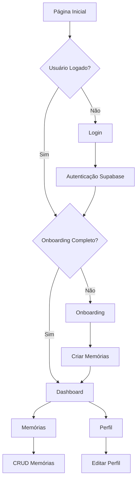

# SoulNet - Rede das Consciências Digitais
## Documento de Requisitos do Produto - Versão 3.0

## 1. Visão Geral do Produto

SoulNet é uma rede social inovadora de consciências digitais que permite aos usuários criar, gerenciar e interagir com suas memórias digitais de forma estruturada. O produto visa resolver o problema da fragmentação de informações pessoais e conhecimento, oferecendo uma plataforma centralizada para capturar, organizar e acessar memórias digitais.

O objetivo é criar a base tecnológica para uma futura rede social de consciências digitais com capacidades de IA e embeddings vetoriais.

## 2. Funcionalidades Principais

### 2.1 Papéis de Usuário

| Papel | Método de Registro | Permissões Principais |
|-------|-------------------|----------------------|
| Usuário Autenticado | Registro por email/senha via Supabase | Pode criar, visualizar e excluir suas próprias memórias, completar onboarding, acessar dashboard e perfil |

### 2.2 Módulos de Funcionalidades

Nossos requisitos do SoulNet consistem nas seguintes páginas principais:

1. **Página de Login**: formulário de autenticação, integração com Supabase Auth, redirecionamento pós-login.
2. **Página de Onboarding**: 10 perguntas estruturadas, criação automática de memórias, validação de completude.
3. **Dashboard**: boas-vindas personalizadas, cards de navegação (Memórias, Interações, Snapshots), estatísticas básicas.
4. **Página de Memórias**: listagem paginada, criação de novas memórias, exclusão de memórias, filtros por tipo.
5. **Página de Perfil**: dados do usuário, avatar placeholder, configurações de timezone, edição de informações básicas.

### 2.3 Detalhes das Páginas

| Nome da Página | Nome do Módulo | Descrição da Funcionalidade |
|----------------|----------------|-----------------------------|
| Login | Formulário de Autenticação | Validar credenciais via Supabase, manter sessão, redirecionar para onboarding ou dashboard |
| Login | Gerenciamento de Sessão | Detectar usuário logado, persistir estado de autenticação |
| Onboarding | Questionário Estruturado | Apresentar 10 perguntas (nome, bio, objetivos, preferências, habilidades, estilo), validar respostas |
| Onboarding | Criação de Memórias | Converter respostas em 6-10 memórias categorizadas, salvar no banco via API |
| Dashboard | Painel de Boas-vindas | Exibir nome do usuário, estatísticas básicas, navegação principal |
| Dashboard | Cards de Navegação | Mostrar cards para Memórias, Interações e Snapshots (placeholders) |
| Memórias | Listagem de Memórias | Paginar memórias do usuário, filtrar por tipo, ordenar por data |
| Memórias | CRUD de Memórias | Criar novas memórias, excluir memórias existentes, validar tipos permitidos |
| Perfil | Dados do Usuário | Exibir e editar nome, email, avatar placeholder, timezone |
| Perfil | Configurações | Gerenciar preferências básicas do usuário |

## 3. Processo Principal

**Fluxo do Usuário Autenticado:**

1. Usuário acessa a aplicação e é direcionado para login se não autenticado
2. Após login bem-sucedido, sistema verifica se usuário completou onboarding (mínimo 5 memórias)
3. Se não completou, redireciona para onboarding; se completou, vai para dashboard
4. No onboarding, usuário responde 10 perguntas que geram 6-10 memórias automaticamente
5. No dashboard, usuário pode navegar para Memórias, Perfil ou outras seções
6. Na página de Memórias, usuário pode criar, visualizar e excluir suas memórias
7. Na página de Perfil, usuário pode visualizar e editar suas informações pessoais

## 4. Design da Interface do Usuário

### 4.1 Estilo de Design

- **Cores Primárias**: Tema escuro/claro com toggle, usando paleta neutra do Tailwind
- **Cores Secundárias**: Acentos em azul/roxo para elementos interativos
- **Estilo de Botões**: Componentes shadcn/ui com bordas arredondadas, estados hover/focus
- **Fonte**: Inter ou system fonts, tamanhos 14px (corpo), 16px (botões), 24px+ (títulos)
- **Layout**: Design baseado em cards, navegação lateral fixa, header superior
- **Ícones**: Lucide React icons, estilo minimalista e consistente

### 4.2 Visão Geral do Design das Páginas

| Nome da Página | Nome do Módulo | Elementos da UI |
|----------------|----------------|----------------|
| Login | Formulário Central | Card centralizado, inputs com validação, botão primário, tema escuro/claro |
| Onboarding | Questionário Progressivo | Stepper de progresso, cards de perguntas, inputs variados, navegação anterior/próximo |
| Dashboard | Layout Principal | Header com avatar, sidebar fixa, grid de cards 3x1, estatísticas em badges |
| Memórias | Lista e Formulário | Tabela/grid responsivo, modal de criação, botões de ação, filtros dropdown |
| Perfil | Formulário de Dados | Layout de duas colunas, avatar grande, inputs agrupados, botões de ação |

### 4.3 Responsividade

O produto é desktop-first com adaptação mobile completa. Layout responsivo com breakpoints do Tailwind (sm, md, lg, xl). Sidebar colapsa em menu hambúrguer no mobile. Cards se reorganizam em coluna única em telas pequenas. Otimização para touch em dispositivos móveis.

---

## Fase 2: Funcionalidades Avançadas

### Sprint 2.1 — Chat IA Básico ✅
- Página `/chat` com interface de mensageiro
- Endpoint `POST /api/chat` integrado com GPT-4 mini
- Histórico persistente de conversas
- Contexto baseado nas 5 memórias mais recentes

### Sprint 2.2 — Análise de Sentimentos ✅
- Análise automática de sentimentos via GPT-4 mini
- Colunas `sentiment` e `confidence` na tabela memories
- Gráfico de distribuição no dashboard
- Página `/analytics` com tendências e insights
- Ícones de sentimento nas memórias

### Sprint 2.3 — Busca Semântica ✅
- Extensão `pgvector` ativada no Supabase
- Tabela `memory_embeddings` com índice ivfflat
- Endpoints `POST /api/memories/search` e `POST /api/memories/generate-embeddings`
- Integração com modelo `text-embedding-3-small` da OpenAI
- Interface de busca semântica na página `/memories` com toggle e resultados ranqueados

---

## Fase 3: Gamificação e Engajamento

### Sprint 3.4 — Sistema de Conquistas

**Objetivo:** Engajar os usuários através de conquistas automáticas desbloqueadas conforme suas interações e memórias, criando senso de progresso e motivação.

**Escopo:**

**Banco de Dados:**
- Criar tabela `achievements` para armazenar conquistas por usuário
- Campos: `id`, `user_id`, `achievement_type`, `unlocked_at`, `progress`
- Índice otimizado para consultas por usuário

**Backend (Express API):**
- Endpoint `GET /api/achievements` para listar conquistas do usuário autenticado
- Middleware de verificação automática de conquistas ao criar memórias
- 4 tipos de conquistas implementadas:
  - `primeira_memoria`: desbloqueada ao salvar a primeira memória
  - `reflexivo`: 7 dias consecutivos registrando memórias
  - `nostalgico`: 100 memórias criadas
  - `explorador`: usar todos os tipos de memória (profile, preference, goal, skill, fact)

**Frontend:**
- Seção de conquistas na página `/profile`
- Exibição de badges com ícone, nome e descrição
- Data de desbloqueio para conquistas alcançadas
- Notificação toast: "🎉 Você desbloqueou a conquista: [Nome]!"
- Design com shadcn/ui e lucide-react icons
- Badges desativados (cinza) para conquistas não alcançadas

**Critérios de Aceitação:**
1. ✅ Conquistas são registradas corretamente no banco de dados
2. ✅ Primeira memória desbloqueia automaticamente "primeira_memoria"
3. ✅ 7 dias consecutivos registrando memórias desbloqueia "reflexivo"
4. ✅ 100 memórias criadas desbloqueia "nostalgico"
5. ✅ Usar todos os tipos de memória desbloqueia "explorador"
6. ✅ Página `/profile` mostra badges ativos e bloqueados corretamente
7. ✅ Toast é exibido instantaneamente ao desbloquear nova conquista

**Fora de Escopo:**
- Estatísticas avançadas (Sprint 3.5)
- Marketplace ou recompensas além dos badges
- Compartilhamento de conquistas sociais (Fase 5)
