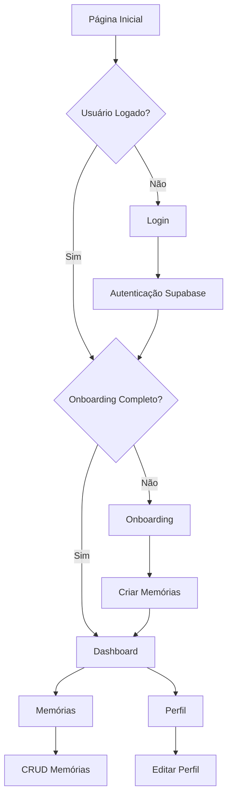

# SoulNet - Rede das Consciências Digitais
## Documento de Requisitos do Produto - Versão 4.1

## 1. Visão Geral do Produto

SoulNet é uma rede social inovadora de consciências digitais que permite aos usuários criar, gerenciar e interagir com suas memórias digitais de forma estruturada. O produto visa resolver o problema da fragmentação de informações pessoais e conhecimento, oferecendo uma plataforma centralizada para capturar, organizar e acessar memórias digitais.

O objetivo é criar a base tecnológica para uma futura rede social de consciências digitais com capacidades de IA e embeddings vetoriais.

## 2. Funcionalidades Principais

### 2.1 Papéis de Usuário

| Papel | Método de Registro | Permissões Principais |
|-------|-------------------|----------------------|
| Usuário Autenticado | Registro por email/senha via Supabase | Pode criar, visualizar e excluir suas próprias memórias, completar onboarding, acessar dashboard e perfil |

### 2.2 Módulos de Funcionalidades

Nossos requisitos do SoulNet consistem nas seguintes páginas principais:

1. **Página de Login**: formulário de autenticação, integração com Supabase Auth, redirecionamento pós-login.
2. **Página de Onboarding**: 10 perguntas estruturadas, criação automática de memórias, validação de completude.
3. **Dashboard**: boas-vindas personalizadas, cards de navegação (Memórias, Interações, Snapshots), estatísticas básicas.
4. **Página de Memórias**: listagem paginada, criação de novas memórias, exclusão de memórias, filtros por tipo.
5. **Página de Perfil**: dados do usuário, avatar placeholder, configurações de timezone, edição de informações básicas.

### 2.3 Detalhes das Páginas

| Nome da Página | Nome do Módulo | Descrição da Funcionalidade |
|----------------|----------------|-----------------------------|
| Login | Formulário de Autenticação | Validar credenciais via Supabase, manter sessão, redirecionar para onboarding ou dashboard |
| Login | Gerenciamento de Sessão | Detectar usuário logado, persistir estado de autenticação |
| Onboarding | Questionário Estruturado | Apresentar 10 perguntas (nome, bio, objetivos, preferências, habilidades, estilo), validar respostas |
| Onboarding | Criação de Memórias | Converter respostas em 6-10 memórias categorizadas, salvar no banco via API |
| Dashboard | Painel de Boas-vindas | Exibir nome do usuário, estatísticas básicas, navegação principal |
| Dashboard | Cards de Navegação | Mostrar cards para Memórias, Interações e Snapshots (placeholders) |
| Memórias | Listagem de Memórias | Paginar memórias do usuário, filtrar por tipo, ordenar por data |
| Memórias | CRUD de Memórias | Criar novas memórias, excluir memórias existentes, validar tipos permitidos |
| Perfil | Dados do Usuário | Exibir e editar nome, email, avatar placeholder, timezone |
| Perfil | Configurações | Gerenciar preferências básicas do usuário |

## 3. Processo Principal

**Fluxo do Usuário Autenticado:**

1. Usuário acessa a aplicação e é direcionado para login se não autenticado
2. Após login bem-sucedido, sistema verifica se usuário completou onboarding (mínimo 5 memórias)
3. Se não completou, redireciona para onboarding; se completou, vai para dashboard
4. No onboarding, usuário responde 10 perguntas que geram 6-10 memórias automaticamente
5. No dashboard, usuário pode navegar para Memórias, Perfil ou outras seções
6. Na página de Memórias, usuário pode criar, visualizar e excluir suas memórias
7. Na página de Perfil, usuário pode visualizar e editar suas informações pessoais



## 4. Design da Interface do Usuário

### 4.1 Estilo de Design

- **Cores Primárias**: Tema escuro/claro com toggle, usando paleta neutra do Tailwind
- **Cores Secundárias**: Acentos em azul/roxo para elementos interativos
- **Estilo de Botões**: Componentes shadcn/ui com bordas arredondadas, estados hover/focus
- **Fonte**: Inter ou system fonts, tamanhos 14px (corpo), 16px (botões), 24px+ (títulos)
- **Layout**: Design baseado em cards, navegação lateral fixa, header superior
- **Ícones**: Lucide React icons, estilo minimalista e consistente

### 4.2 Visão Geral do Design das Páginas

| Nome da Página | Nome do Módulo | Elementos da UI |
|----------------|----------------|----------------|
| Login | Formulário Central | Card centralizado, inputs com validação, botão primário, tema escuro/claro |
| Onboarding | Questionário Progressivo | Stepper de progresso, cards de perguntas, inputs variados, navegação anterior/próximo |
| Dashboard | Layout Principal | Header com avatar, sidebar fixa, grid de cards 3x1, estatísticas em badges |
| Memórias | Lista e Formulário | Tabela/grid responsivo, modal de criação, botões de ação, filtros dropdown |
| Perfil | Formulário de Dados | Layout de duas colunas, avatar grande, inputs agrupados, botões de ação |

### 4.3 Responsividade

O produto é desktop-first com adaptação mobile completa. Layout responsivo com breakpoints do Tailwind (sm, md, lg, xl). Sidebar colapsa em menu hambúrguer no mobile. Cards se reorganizam em coluna única em telas pequenas. Otimização para touch em dispositivos móveis.

---

## Fase 2: Funcionalidades Avançadas

### Sprint 2.1 — Chat IA Básico ✅
- Página `/chat` com interface de mensageiro
- Endpoint `POST /api/chat` integrado com GPT-4 mini
- Histórico persistente de conversas
- Contexto baseado nas 5 memórias mais recentes

### Sprint 2.2 — Análise de Sentimentos ✅
- Análise automática de sentimentos via GPT-4 mini
- Colunas `sentiment` e `confidence` na tabela memories
- Gráfico de distribuição no dashboard
- Página `/analytics` com tendências e insights
- Ícones de sentimento nas memórias

### Sprint 2.3 — Busca Semântica ✅
- Extensão `pgvector` ativada no Supabase
- Tabela `memory_embeddings` com índice ivfflat
- Endpoints `POST /api/memories/search` e `POST /api/memories/generate-embeddings`
- Integração com modelo `text-embedding-3-small` da OpenAI
- Interface de busca semântica na página `/memories` com toggle e resultados ranqueados

---

## Fase 3: Gamificação e Engajamento

### Sprint 3.4 — Sistema de Conquistas

**Objetivo:** Engajar os usuários através de conquistas automáticas desbloqueadas conforme suas interações e memórias, criando senso de progresso e motivação.

**Escopo:**

**Banco de Dados:**
- Criar tabela `achievements` para armazenar conquistas por usuário
- Campos: `id`, `user_id`, `achievement_type`, `unlocked_at`, `progress`
- Índice otimizado para consultas por usuário

**Backend (Express API):**
- Endpoint `GET /api/achievements` para listar conquistas do usuário autenticado
- Middleware de verificação automática de conquistas ao criar memórias
- 4 tipos de conquistas implementadas:
  - `primeira_memoria`: desbloqueada ao salvar a primeira memória
  - `reflexivo`: 7 dias consecutivos registrando memórias
  - `nostalgico`: 100 memórias criadas
  - `explorador`: usar todos os tipos de memória (profile, preference, goal, skill, fact)

**Frontend:**
- Seção de conquistas na página `/profile`
- Exibição de badges com ícone, nome e descrição
- Data de desbloqueio para conquistas alcançadas
- Notificação toast: "🎉 Você desbloqueou a conquista: [Nome]!"
- Design com shadcn/ui e lucide-react icons
- Badges desativados (cinza) para conquistas não alcançadas

**Critérios de Aceitação:**
1. ✅ Conquistas são registradas corretamente no banco de dados
2. ✅ Primeira memória desbloqueia automaticamente "primeira_memoria"
3. ✅ 7 dias consecutivos registrando memórias desbloqueia "reflexivo"
4. ✅ 100 memórias criadas desbloqueia "nostalgico"
5. ✅ Usar todos os tipos de memória desbloqueia "explorador"
6. ✅ Página `/profile` mostra badges ativos e bloqueados corretamente
7. ✅ Toast é exibido instantaneamente ao desbloquear nova conquista

**Fora de Escopo:**
- Marketplace ou recompensas além dos badges
- Compartilhamento de conquistas sociais (Fase 5)

### Sprint 3.5 — Estatísticas Pessoais (Analytics)

**Objetivo:** Oferecer ao usuário uma visão clara e visual de sua jornada no SoulNet, com métricas, gráficos interativos e streaks de engajamento.

**Escopo:**

**Backend (Express API):**
- Endpoint `GET /api/analytics` que retorna dados agregados do usuário autenticado:
  * Total de memórias
  * Memórias por mês/ano
  * Distribuição por type (profile, goal, etc)
  * Distribuição por sentiment (positive, neutral, negative)
  * Dias consecutivos ativos (streak)
- Query otimizada usando GROUP BY + filtros por user_id
- Middleware requireAuth aplicado

**Frontend:**
- Página `/analytics` com gráficos interativos usando Chart.js + react-chartjs-2:
  * Line Chart → memórias por mês
  * Pie Chart → distribuição por sentimento
  * Bar Chart → distribuição por tipo de memória
  * Counter Card → streak de dias consecutivos
- Dashboard responsivo (mobile/desktop)
- Loading skeletons para gráficos
- Tooltips nos gráficos com detalhes
- Cores consistentes: positivo=verde, neutro=cinza, negativo=vermelho

**Critérios de Aceitação:**
1. ✅ Endpoint retorna dados corretos agregados por usuário
2. ✅ Página `/analytics` exibe ao menos 3 gráficos + 1 contador de streak
3. ✅ Gráficos são responsivos e interativos (tooltip, legenda)
4. ✅ Dashboard carrega em < 2 segundos com até 10k memórias
5. ✅ Streak é calculado corretamente

**Fora de Escopo:**
- Exportação dos dados (Fase 4)
- Comparação entre usuários (Fase 5)
- Insights automáticos da IA (Fase futura)

---

## Fase 4: Progressive Web App (PWA)

### Sprint 4.1 — PWA Core (Install + Offline + Sync básico)

**Objetivo:** Tornar o SoulNet um PWA instalável e resiliente offline com cache de assets, leitura básica offline, fila para criar memórias quando estiver sem conexão, e fundação para push notifications.

**Escopo:**

**1) Manifesto e Metadados:**
- Arquivo `public/manifest.webmanifest` com configurações PWA:
  * `name`: "SoulNet - Rede das Consciências Digitais"
  * `short_name`: "SoulNet"
  * `start_url`: "/dashboard"
  * `display`: "standalone"
  * `theme_color` e `background_color` consistentes com o design
- Ícones PWA 192x192 e 512x512 pixels (versões dark/light)
- Metatags no `index.html`: `theme-color`, `apple-touch-icon`, `apple-mobile-web-app-capable`

**2) Service Worker (Workbox):**
- Implementação em `service-worker.ts` usando Workbox:
  * Pré-cache do shell da aplicação (build estático do Vite)
  * Estratégia `CacheFirst` para assets estáticos (.css, .js, fontes, ícones)
  * Estratégia `StaleWhileRevalidate` para `GET /api/health` e `GET /api/memories`
  * Background Sync para `POST /api/memories` (fila offline, reenvia quando conexão volta)
  * Fallback de navegação para `/offline.html` com CTA "Tentar novamente"

**3) Sistema de Instalação:**
- Prompt customizado de instalação quando `beforeinstallprompt` disparar
- Banner discreto no header com opção de instalar
- Página `/settings` com seção "App" mostrando status "Instalado" / "Não instalado"
- Botão "Instalar App" quando disponível

**4) Push Notifications (Infraestrutura):**
- Geração e leitura de VAPID keys via variáveis de ambiente:
  * `VAPID_PUBLIC_KEY`
  * `VAPID_PRIVATE_KEY`
- Tabela `user_push_subscriptions` no banco:
  ```sql
  CREATE TABLE IF NOT EXISTS user_push_subscriptions (
    id UUID PRIMARY KEY DEFAULT gen_random_uuid(),
    user_id UUID REFERENCES users(id) ON DELETE CASCADE,
    endpoint TEXT NOT NULL,
    p256dh TEXT NOT NULL,
    auth TEXT NOT NULL,
    created_at TIMESTAMPTZ DEFAULT NOW(),
    UNIQUE(user_id, endpoint)
  );
  CREATE INDEX IF NOT EXISTS idx_user_push_subscriptions_user ON user_push_subscriptions(user_id);
  ```
- Endpoint `POST /api/push/subscribe` protegido por `requireAuth`
- Service Worker escuta eventos `push` (placeholder: "Registration successful")

**5) Frontend - Indicadores e UX:**
- Indicadores de conectividade (online/offline) no header
- Toast amigável quando memória for enfileirada offline: "📱 Memória salva offline"
- Toast de sincronização: "✅ Memória sincronizada"
- Página `/settings` com bloco PWA:
  * Status de instalação
  * Botão "Instalar App"
  * Status de notificações push

**6) Backend (Express):**
- Rota `POST /api/push/subscribe` protegida por `requireAuth`
- Salva/atualiza inscrição push no banco
- Sem envio real de push (apenas infraestrutura)

**7) Build e Configuração:**
- Configuração do Vite para registrar Service Worker
- Variáveis de ambiente VAPID no `.env.example`
- Verificação HTTPS em produção (Vercel) para PWA funcionar

**Critérios de Aceitação:**
1. ✅ App instalável em Chrome/Edge/Android (banner aparece, app abre standalone)
2. ✅ Sem internet: app abre shell + páginas básicas, GET de memórias retorna cache
3. ✅ Criar memória offline: entra em fila e sincroniza quando conexão volta
4. ✅ Service Worker registra sem erros no console
5. ✅ Subscrição de push salva em `user_push_subscriptions`
6. ✅ Lighthouse PWA score ≥ 90 (instalável, SW ativo, manifest válido)
7. ✅ Indicadores de conectividade funcionais
8. ✅ Toasts de offline/sync aparecem corretamente

**Fora de Escopo (próximas sprints):**
- Sprint 4.3: Exportar/Excluir Dados (LGPD/GDPR)
- Sprint 4.4: Push real de lembretes (Web Push com agenda)

**Tecnologias:**
- Workbox para Service Worker
- Web App Manifest
- Background Sync API
- Push API (infraestrutura)
- VAPID keys para autenticação push

### Sprint 4.2 — Upload de Mídia (Fotos & Áudio) ✅

**Objetivo:** Permitir que os usuários anexem imagens e áudios às memórias, armazenando no Supabase Storage com compressão e preview integrado.

**Escopo:**

**1) Banco de Dados:**
- Tabela `memory_media` criada:
```sql
CREATE TABLE memory_media (
  id uuid PRIMARY KEY DEFAULT gen_random_uuid(),
  memory_id uuid NOT NULL REFERENCES memories(id) ON DELETE CASCADE,
  file_url text NOT NULL,
  file_type text CHECK (file_type IN ('image','audio')),
  file_size integer,
  uploaded_at timestamptz DEFAULT now()
);
CREATE INDEX idx_memory_media_memory_id ON memory_media(memory_id);
```

**2) Supabase Storage:**
- Bucket `media` configurado com regras RLS
- Acesso restrito: apenas dono pode ler/escrever seus arquivos
- Compressão automática de imagens antes do upload
- Tipos aceitos: imagens (jpeg/png/webp) e áudios (mp3/wav)

**3) Backend (Express API):**
- Endpoint `POST /api/memories/:id/media` protegido:
  * Validação de `user_id` da memória (não permite upload em memória de outro usuário)
  * Upload para Supabase Storage bucket `media`
  * Retorna `{ url, type, size }`
- Endpoint `GET /api/memories/:id/media`:
  * Lista arquivos anexados à memória
  * Filtrado por permissão do usuário

**4) Frontend:**
- Componente `MediaUpload` na página `/memories`:
  * Drag & drop para upload de arquivos
  * Preview inline de imagens
  * Player básico para áudios
  * Barra de progresso durante upload
  * Validações: máx. 5 arquivos por memória, 10MB por arquivo
- Componente `MediaGallery` nos cards de memória:
  * Miniaturas clicáveis de imagens (modal com zoom)
  * Player de áudio embutido
  * Feedback visual de limite atingido ("5/5 anexos")

**5) UX e Validações:**
- Toasts de sucesso/erro com detalhes do arquivo
- Mensagem informativa quando limite de arquivos atingido
- Feedback visual durante upload com progresso real
- Validação de tipos de arquivo no frontend e backend

**6) Variáveis de Ambiente:**
```env
MAX_FILE_SIZE=10485760   # 10MB
ALLOWED_FILE_TYPES=image/jpeg,image/png,image/webp,audio/mpeg,audio/wav
SUPABASE_STORAGE_BUCKET=media
```

**Critérios de Aceitação:**
1. ✅ Upload protegido respeitando owner (user_id)
2. ✅ Apenas imagens (jpeg/png/webp) e áudios (mp3/wav) aceitos
3. ✅ Preview de imagens e player de áudio funcionais no frontend
4. ✅ Barra de progresso visível durante upload
5. ✅ Mensagem de erro se ultrapassar limite de 10MB ou 5 arquivos
6. ✅ Galeria de mídia integrada aos cards de memória
7. ✅ Modal de zoom para imagens e controles de áudio

**Fora de Escopo:**
- Vídeo (Sprint futura)
- Compressão de áudio avançada
- Exportação de mídia (Sprint 4.3)

**Tecnologias:**
- Supabase Storage para armazenamento
- Multer para upload multipart/form-data
- Sharp para compressão de imagens (futuro)
- HTML5 Audio API para player
