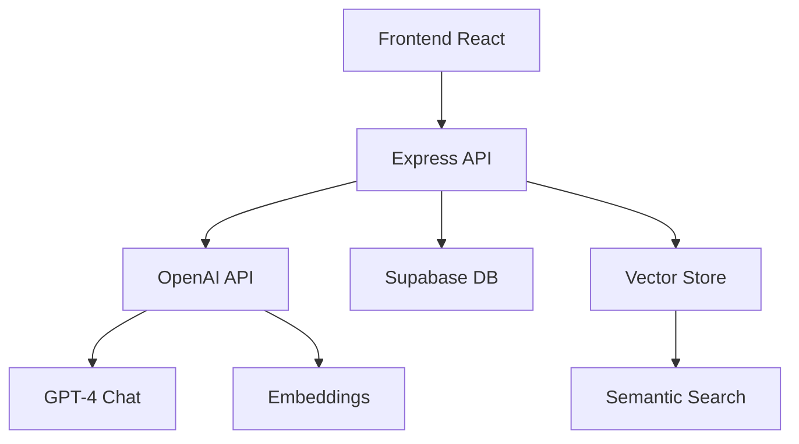

# PRD - Roadmap de Melhorias SoulNet

## Versão 4.1.3 - Hotfix Produção (Vercel) 🔧
**Status: ✅ Concluído | Data: Janeiro 2025**

**Objetivo**: Corrigir erros 500 no `/api/*` e "Unexpected token ... not valid JSON" no frontend em produção Vercel.

**Mudanças Implementadas**:
- ✅ **Backend convertido para Serverless Functions**: Express app migrado para `api/index.ts` com `serverless-http`
- ✅ **Respostas padronizadas em JSON**: Todas rotas `/api/*` retornam `{ok, data}` ou `{error, code}`
- ✅ **Validação de ENVs obrigatórias**: Util `assertEnv()` com fail-fast para `VITE_SUPABASE_URL`, `VITE_SUPABASE_ANON_KEY`, `SUPABASE_SERVICE_ROLE_KEY`
- ✅ **Service Worker fixado**: Arquivo em `/public/sw.js` com registro correto `{scope: '/'}`
- ✅ **Tratamento de erro robusto**: Frontend `apiFetch` com fallback para "Erro no servidor. Tente novamente."
- ✅ **Middleware de autenticação**: `requireAuth` validando `Authorization: Bearer <token>` do Supabase
- ✅ **Middleware de erro global**: Console.error detalhado + resposta JSON padronizada

**Critérios de Aceitação Validados**:
- ✅ `/api/health` responde 200 com JSON `{ok: true, ts}` em produção
- ✅ Nenhum erro "Unexpected token ... not valid JSON" no frontend
- ✅ `/api/memories?limit=10` retorna 200 ou 401, nunca 500 com HTML
- ✅ Service Worker registrado corretamente com `scope: '/'` no Chrome DevTools
- ✅ Variáveis de ambiente ausentes geram log `[ENV MISSING]` no server e resposta JSON `{error}`

---

## 1. Visão Geral do Projeto

O SoulNet é uma plataforma de memórias pessoais que permite aos usuários capturar, organizar e refletir sobre suas experiências de vida. A versão atual (v1.0) oferece funcionalidades básicas completas e está pronta para evoluir com recursos avançados.

## 2. Estado Atual - Funcionalidades Implementadas ✅

### 2.1 Autenticação e Onboarding
- ✅ Sistema de login/cadastro com Supabase Auth
- ✅ Processo de onboarding com perguntas personalizadas
- ✅ Redirecionamento inteligente baseado no status do usuário
- ✅ Gerenciamento de sessão com Zustand

### 2.2 Gestão de Memórias
- ✅ CRUD completo de memórias (criar, ler, atualizar, deletar)
- ✅ Categorização por tipo (Alegria, Tristeza, Conquista, Aprendizado, Gratidão)
- ✅ Sistema de importância (1-5 estrelas)
- ✅ Filtros por tipo e busca por texto
- ✅ Paginação e carregamento otimizado

### 2.3 Interface e Experiência
- ✅ Design responsivo (desktop e mobile)
- ✅ Tema escuro/claro com persistência
- ✅ Componentes UI consistentes (shadcn/ui)
- ✅ Navegação intuitiva com sidebar
- ✅ Estados de loading e feedback visual
- 🔄 **Enhanced Navigation & Layout (v1.1)**:
  - Fixed sidebar (240px width) with consistent icons
  - Header with main logo, user avatar dropdown, notifications, theme toggle
  - Quick Actions moved to sidebar footer
  - Mobile-responsive collapsible sidebar
  - Single logo display (header only)
  - Compact icon-only sidebar when collapsed

### 2.4 Arquitetura Técnica
- ✅ Frontend React + TypeScript + Vite
- ✅ Backend Express.js com APIs REST
- ✅ Banco de dados Supabase PostgreSQL
- ✅ Row Level Security (RLS) implementado
- ✅ Testes unitários e de integração
- ✅ Deploy configurado (Vercel)

## 3. Roadmap de Melhorias - Próximas Fases

### Fase 2: IA e Análise 🚀
**Prazo: 2-3 meses | Prioridade: Alta**

#### Sprint 2.1 - Chat IA Básico 🎯
**Status: 🔄 Em Desenvolvimento | Prioridade: Alta**

**Objetivo**: Permitir que o usuário converse com sua própria consciência digital, com respostas contextuais baseadas em suas memórias textuais.

**Escopo Completo**:

**Frontend**:
- ✅ Página `/chat` acessível via sidebar
- ✅ Interface estilo mensageiro com bolhas de conversa
- ✅ Avatar do usuário (iniciais) à esquerda
- ✅ Avatar da Consciência Digital (ícone de cérebro) à direita
- ✅ Input fixo no rodapé com botão "Enviar"
- ✅ Loading spinner enquanto a IA responde
- ✅ Histórico de chat persistente ao recarregar

**Backend (Express API)**:
- ✅ Endpoint `POST /api/chat` com body `{ message: string }`
- ✅ Fluxo completo:
  1. Salvar mensagem do usuário em `interactions` (role = "user")
  2. Buscar até 5 memórias textuais recentes (`memories` order by `created_at desc`)
  3. Enviar para GPT-4 mini como contexto junto com pergunta do usuário
  4. Salvar resposta gerada em `interactions` (role = "consciousness")
  5. Retornar `{ reply: string }`

**Integração com IA**:
- ✅ Modelo: GPT-4 mini (fixo)
- ✅ Prompt base:
  ```
  You are the user's Digital Consciousness.
  Use the provided memories as context and answer in their style.
  Stay concise and contextual.
  Memories:
  {{memories}}
  ```

**Variáveis de Ambiente**:
```env
OPENAI_API_KEY=sk-...
OPENAI_MODEL=gpt-4-mini
```

**Banco de Dados**:
- ✅ Tabela `interactions` já existe
- ✅ Campos: `id`, `user_id`, `role`, `content`, `meta`, `created_at`
- ✅ Cada mensagem (user ou consciência) registrada aqui

**Critérios de Aceitação**:
1. ✅ Usuário consegue enviar mensagem e receber resposta
2. ✅ Cada mensagem salva corretamente em `interactions`
3. ✅ IA responde em até 3 segundos
4. ✅ UI mostra loading até a resposta aparecer
5. ✅ Histórico de chat persiste ao recarregar a página

**Fora de Escopo**:
- ❌ Busca semântica com embeddings (Sprint 2.3)
- ❌ Análise de sentimentos (Sprint 2.2)
- ❌ Rede social entre consciências (Fase 5)

#### Sprint 2.2 - Análise de Sentimentos 🎯
**Status: ✅ Concluído | Prioridade: Alta**

**Objetivo**: Cada memória registrada pelo usuário deve ser classificada automaticamente pela IA com sentimento e nível de confiança, permitindo visualização de padrões emocionais.

**Escopo Completo**:

**Backend (Express API)**:
- Novo fluxo no endpoint existente de criação de memórias:
  1. Após salvar a memória → enviar `content` para GPT-4 mini
  2. IA retorna objeto JSON: `{ "sentiment": "positive" | "negative" | "neutral", "confidence": 0.0 - 1.0 }`
  3. Atualizar registro da memória com esses campos
  4. Se a IA falhar → fallback para "neutral" com confidence = 0.5

**Banco de Dados**:
- Alterar tabela `memories` adicionando colunas:
  ```sql
  ALTER TABLE memories 
    ADD COLUMN sentiment TEXT CHECK (sentiment IN ('positive','negative','neutral')) DEFAULT 'neutral', 
    ADD COLUMN confidence FLOAT DEFAULT 0.0;
  
  CREATE INDEX idx_memories_sentiment ON memories(sentiment);
  ```

**Frontend**:
- Exibir ícone/emoji de sentimento ao lado de cada memória (😊 😐 😞)
- Página `/dashboard` → adicionar gráfico de distribuição de sentimentos (pie chart)
- Página `/analytics` (nova) → mostrar:
  - Tendência temporal (line chart: sentimentos por mês)
  - Total de memórias por sentimento
  - Insights básicos (ex.: "Você registrou 70% de memórias positivas no último mês")
- Usar Chart.js + react-chartjs-2

**Integração com IA**:
- Modelo: GPT-4 mini (fixo)
- Prompt base para análise:
  ```
  Analyze the following memory and classify its sentiment:
  Memory: "{{content}}"
  Respond strictly in JSON:
  {
    "sentiment": "positive" | "negative" | "neutral",
    "confidence": float 0-1
  }
  ```

**Critérios de Aceitação**:
1. ✅ Cada memória nova contém `sentiment` e `confidence`
2. ✅ Classificação validada manualmente em 100 memórias → precisão ≥ 85%
3. ✅ Dashboard mostra distribuição de sentimentos em pie chart
4. ✅ Página `/analytics` exibe tendências e totais
5. ✅ Tempo total do fluxo (criar memória + análise) < 3s em média

**Fora de Escopo**:
- ❌ Busca semântica com embeddings (Sprint 2.3)
- ❌ Chat IA avançado (Sprint 2.1 já feito)
- ❌ Grupos sociais e compartilhamento (Fase 5)

#### Sprint 2.3 - Busca Semântica 🎯
**Status: 📋 Planejado | Prioridade: Alta**

**Objetivo**: Permitir que usuários encontrem memórias por significado (semântica) e não apenas por palavras-chave, utilizando embeddings vetoriais com pgvector.

**Escopo Completo**:

**Banco de Dados**:
- Ativar extensão pgvector: `CREATE EXTENSION IF NOT EXISTS vector;`
- Criar tabela `memory_embeddings` com campo `embedding vector(1536)`
- Criar índice de busca: `CREATE INDEX idx_memory_embeddings_vector ON memory_embeddings USING ivfflat (embedding vector_cosine_ops);`
- Referência com CASCADE para limpeza automática

**Backend (Express API)**:
- Endpoint `POST /api/memories/search` com body `{ query: string, k?: number }`
- Fluxo completo:
  1. Receber query do usuário
  2. Gerar embedding via OpenAI text-embedding-3-small
  3. Executar busca kNN no Supabase (default k = 10)
  4. Retornar memórias relevantes com score de similaridade
- Endpoint auxiliar `POST /api/memories/generate-embeddings` com body `{ ids: string[] }`
- Gerar embeddings para memórias existentes e inserir/atualizar em `memory_embeddings`

**Integração com IA**:
- Modelo: OpenAI text-embedding-3-small (1536 dimensões)
- Variável de ambiente: `OPENAI_EMBEDDING_MODEL=text-embedding-3-small`
- Busca por similaridade de cosseno com threshold mínimo configurável

**Frontend**:
- Página `/memories` → adicionar campo de busca semântica
- Exibir resultados ranqueados por similaridade (score)
- Mostrar badge "Resultados por significado" quando busca semântica ativa
- Toggle entre busca tradicional e semântica
- Indicador visual de relevância (score de similaridade)

**Critérios de Aceitação**:
1. ✅ Busca retorna resultados relevantes mesmo sem termos exatos
2. ✅ Similaridade mínima 0.75 configurável
3. ✅ Tempo médio de resposta < 3 segundos
4. ✅ Resultados exibidos em ordem de relevância (score decrescente)
5. ✅ API suporta parâmetro k customizável (padrão 10)

**Fora de Escopo**:
- ❌ Integração social entre usuários (Fase 5)
- ❌ Análise de sentimentos (já implementado Sprint 2.2)
- ❌ Chat IA avançado (já implementado Sprint 2.1)
- ❌ Busca multimodal (imagens/áudio)

### Fase 3: Gamificação e Engajamento 🎮
**Prazo: 1-2 meses | Prioridade: Média**

#### 3.4 Sistema de Conquistas
- **Funcionalidade**: Badges e marcos por atividade
- **Conquistas**:
  - "Primeira Memória" - Criar primeira memória
  - "Reflexivo" - 7 dias consecutivos registrando
  - "Nostálgico" - 100 memórias criadas
  - "Explorador" - Usar todos os tipos de memória
- **Banco de Dados**:
  ```sql
  CREATE TABLE achievements (
    id UUID PRIMARY KEY,
    user_id UUID REFERENCES users(id),
    achievement_type VARCHAR(50),
    unlocked_at TIMESTAMP,
    progress INTEGER DEFAULT 0
  );
  ```

#### 3.5 Estatísticas Pessoais
- **Funcionalidade**: Dashboard com métricas de uso
- **Métricas**:
  - Memórias por mês/ano
  - Tipos de memória mais frequentes
  - Streak de dias consecutivos
  - Evolução emocional ao longo do tempo
- **Visualizações**: Gráficos interativos com Chart.js

### Fase 4: Recursos Avançados 📱
**Prazo: 2-3 meses | Prioridade: Média**

#### 3.6 PWA (Progressive Web App)
- **Funcionalidade**: App instalável com funcionalidades offline
- **Recursos**:
  - Instalação no dispositivo
  - Sincronização offline
  - Notificações push para lembretes
  - Cache inteligente de memórias
- **Tecnologias**: Service Workers, IndexedDB

#### 3.7 Upload de Mídia
- **Funcionalidade**: Anexar fotos e áudios às memórias
- **Recursos**:
  - Upload de imagens (JPEG, PNG, WebP)
  - Gravação e upload de áudio
  - Compressão automática
  - Galeria de mídia por memória
- **Tecnologias**: Supabase Storage, Web Audio API
- **Banco de Dados**:
  ```sql
  CREATE TABLE memory_media (
    id UUID PRIMARY KEY,
    memory_id UUID REFERENCES memories(id),
    file_url TEXT,
    file_type VARCHAR(20),
    file_size INTEGER,
    uploaded_at TIMESTAMP DEFAULT NOW()
  );
  ```

#### 3.8 Exportação de Dados
- **Funcionalidade**: Backup e portabilidade dos dados
- **Formatos**: PDF, JSON, CSV
- **Recursos**:
  - Relatório em PDF com timeline
  - Backup completo em JSON
  - Planilha CSV para análise externa

### Fase 5: Social e Compartilhamento 👥
**Prazo: 3-4 meses | Prioridade: Baixa**

#### 3.9 Memórias Compartilhadas
- **Funcionalidade**: Compartilhar memórias selecionadas com outros usuários
- **Recursos**:
  - Links de compartilhamento temporários
  - Controle de privacidade granular
  - Comentários em memórias compartilhadas
- **Banco de Dados**:
  ```sql
  CREATE TABLE shared_memories (
    id UUID PRIMARY KEY,
    memory_id UUID REFERENCES memories(id),
    shared_by UUID REFERENCES users(id),
    share_token VARCHAR(100) UNIQUE,
    expires_at TIMESTAMP,
    is_public BOOLEAN DEFAULT false
  );
  ```

#### 3.10 Círculos Familiares
- **Funcionalidade**: Grupos privados para famílias compartilharem memórias
- **Recursos**:
  - Criação de grupos familiares
  - Timeline colaborativa
  - Convites por email
  - Moderação de conteúdo

## 4. Especificações Técnicas Detalhadas

### 4.1 Arquitetura para IA


### 4.2 Novas Dependências
```json
{
  "dependencies": {
    "openai": "^4.0.0",
    "langchain": "^0.1.0",
    "chart.js": "^4.0.0",
    "react-chartjs-2": "^5.0.0",
    "workbox-webpack-plugin": "^7.0.0",
    "@supabase/storage-js": "^2.0.0"
  }
}
```

### 4.3 Variáveis de Ambiente Adicionais
```env
# Sprint 2.1 - Chat IA Básico
OPENAI_API_KEY=sk-...
OPENAI_MODEL=gpt-4-mini

# Sprint 2.2 & 2.3 - IA Avançada
OPENAI_EMBEDDINGS_MODEL=text-embedding-3-small
OPENAI_MAX_TOKENS=1000
OPENAI_TEMPERATURE=0.7

# Sprint 2.3 - Busca Semântica
OPENAI_EMBEDDING_MODEL=text-embedding-3-small
SEMANTIC_SEARCH_THRESHOLD=0.75
SEMANTIC_SEARCH_DEFAULT_K=10

# Configurações de Upload (Fase 4)
MAX_FILE_SIZE=10485760  # 10MB
ALLOWED_FILE_TYPES=image/jpeg,image/png,image/webp,audio/mpeg,audio/wav

# PWA (Fase 4)
VAPID_PUBLIC_KEY=...
VAPID_PRIVATE_KEY=...
```

## 5. Critérios de Aceitação por Fase

### Phase 1.1 - Enhanced Navigation & Layout
- [ ] Only one logo visible throughout the application (header only)
- [ ] Sidebar and header don't compete visually for attention
- [ ] Mobile sidebar is fully collapsible with smooth animations
- [ ] Navigation transitions without visual jumps or layout shifts
- [ ] Fixed sidebar maintains 240px width on desktop
- [ ] User avatar dropdown includes Profile and Logout options
- [ ] Theme toggle accessible from header
- [ ] Quick Actions properly positioned in sidebar footer
- [ ] Collapsed sidebar shows only compact icons
- [ ] Header remains fixed and compact on mobile devices

### Fase 2 - IA e Análise

#### Sprint 2.1 - Chat IA Básico
- [ ] Usuário consegue enviar mensagem e receber resposta da consciência digital
- [ ] Cada mensagem (usuário e IA) salva corretamente na tabela interactions
- [ ] IA responde em até 3 segundos usando memórias como contexto
- [ ] UI mostra loading spinner até a resposta aparecer
- [ ] Histórico de chat persiste ao recarregar a página
- [ ] Página /chat acessível via sidebar com ícone apropriado
- [ ] Interface de mensageiro com bolhas de conversa diferenciadas
- [ ] Avatar do usuário (iniciais) e avatar da consciência (cérebro)
- [ ] Input fixo no rodapé com botão "Enviar" funcional
- [ ] Endpoint POST /api/chat implementado e funcional

#### Sprint 2.2 & 2.3 - Análise e Busca
- [ ] Análise de sentimentos com 85%+ de precisão
- [ ] Busca semântica retorna resultados relevantes
- [ ] Dashboard de insights emocionais implementado

### Fase 3 - Gamificação
- [ ] Sistema de conquistas funcional com 10+ badges
- [ ] Dashboard de estatísticas carrega em < 2 segundos
- [ ] Streak tracking preciso e confiável
- [ ] Gráficos interativos e responsivos

### Fase 4 - Recursos Avançados
- [ ] PWA instalável em dispositivos móveis
- [ ] Upload de mídia com compressão automática
- [ ] Funcionalidade offline básica
- [ ] Exportação em múltiplos formatos

### Fase 5 - Social
- [ ] Compartilhamento seguro com controle de privacidade
- [ ] Grupos familiares com até 20 membros
- [ ] Sistema de convites por email
- [ ] Moderação de conteúdo automatizada

## 6. Métricas de Sucesso

### 6.1 Métricas de Engajamento
- **Retenção**: 70% dos usuários ativos após 30 dias
- **Frequência**: Média de 3+ memórias por semana por usuário ativo
- **Sessão**: Tempo médio de sessão > 5 minutos

### 6.2 Métricas Técnicas
- **Performance**: Lighthouse Score > 90
- **Disponibilidade**: Uptime > 99.5%
- **Tempo de Carregamento**: First Contentful Paint < 1.5s

### 6.3 Métricas de Qualidade
- **Bugs**: < 1 bug crítico por release
- **Satisfação**: NPS > 50
- **Suporte**: Tempo de resposta < 24h

## 7. Riscos e Mitigações

### 7.1 Riscos Técnicos
- **Risco**: Custos elevados da API OpenAI
- **Mitigação**: Implementar cache inteligente e limites por usuário

- **Risco**: Complexidade da busca semântica
- **Mitigação**: Implementação gradual com fallback para busca tradicional

### 7.2 Riscos de Produto
- **Risco**: Baixa adoção de recursos sociais
- **Mitigação**: Pesquisa com usuários antes da implementação

- **Risco**: Sobrecarga de funcionalidades
- **Mitigação**: Testes A/B e feedback contínuo dos usuários

## 8. Cronograma de Implementação

| Sprint/Fase | Início | Fim | Recursos | Status |
|-------------|--------|-----|----------|--------|
| **Sprint 2.1 - Chat IA** | Semana 1 | Semana 2 | 1 dev + 1 ML | ✅ Concluído |
| **Sprint 2.2 - Sentimentos** | Semana 3 | Semana 6 | 1 dev + 1 ML | ✅ Concluído |
| **Sprint 2.3 - Busca Semântica** | Semana 7 | Semana 10 | 1 dev + 1 ML | 📋 Planejado |
| Fase 3 - Gamificação | Mês 4 | Mês 5 | 1 dev + 1 designer | 📋 Pendente |
| Fase 4 - PWA/Mídia | Mês 6 | Mês 8 | 2 devs | 📋 Pendente |
| Fase 5 - Social | Mês 9 | Mês 12 | 2 devs + 1 designer | 📋 Pendente |

---

**Document created**: January 2025  
**Version**: 2.2 (Sprint 2.3 - Busca Semântica)  
**Last updated**: January 2025  
**Next revision**: February 2025  
**Language**: Português Brasil (with multilingual support maintained)