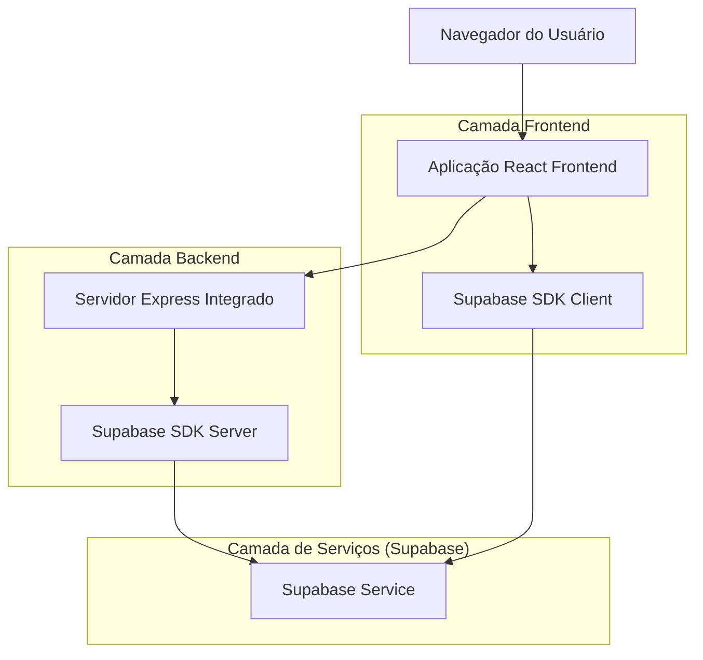
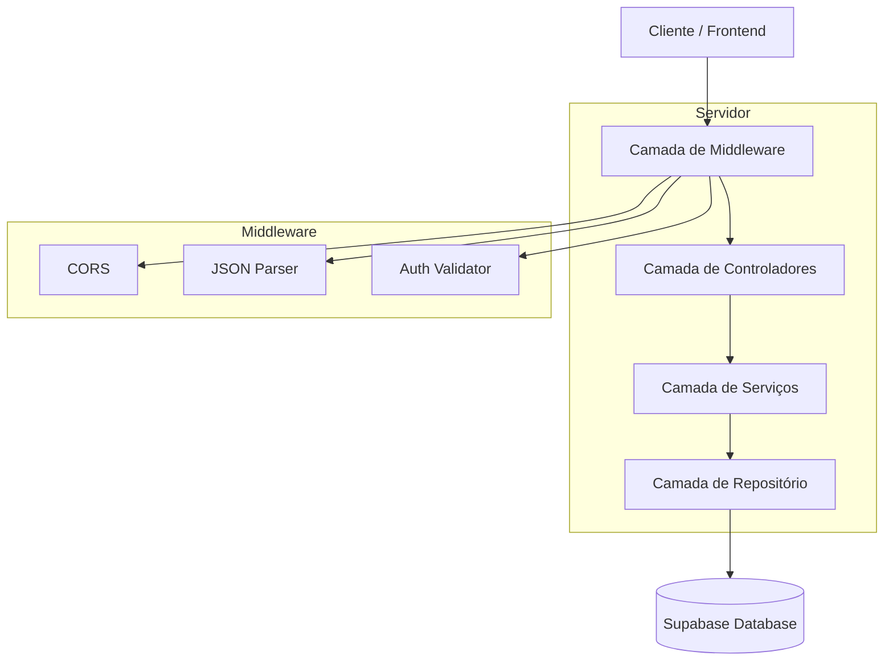
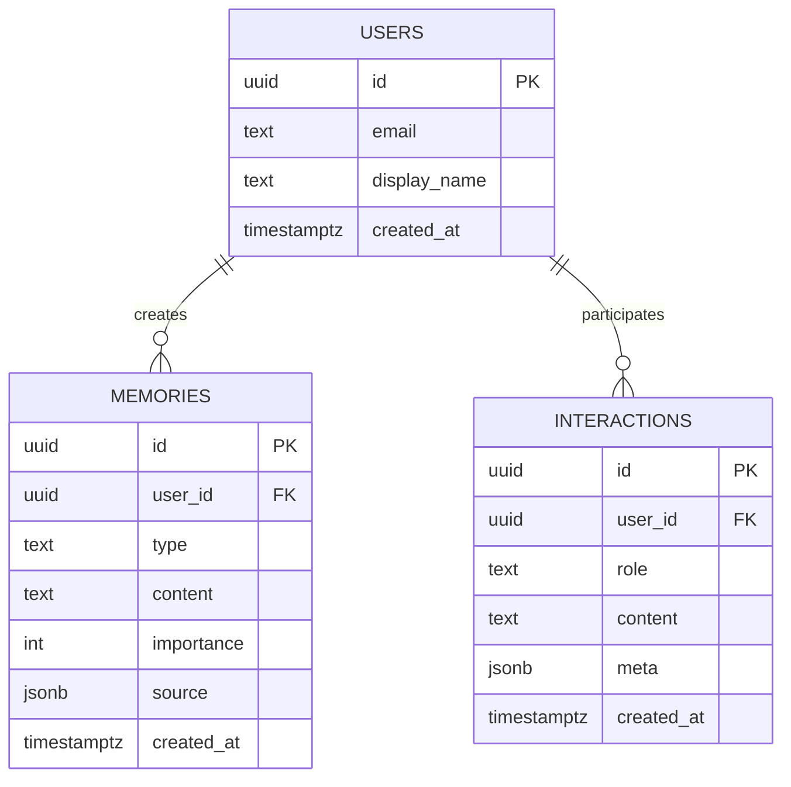

# SoulNet - Arquitetura Técnica
## Documento de Arquitetura - Fase 1: Fundação

## 1. Design da Arquitetura



## 2. Descrição das Tecnologias

- **Frontend**: React@18 + TypeScript@5 + Vite@5 + TailwindCSS@3 + shadcn/ui + Zustand@4
- **Backend**: Express@4 + TypeScript + ts-node
- **Banco de Dados**: Supabase (PostgreSQL) com RLS
- **Autenticação**: Supabase Auth
- **Qualidade**: ESLint + Prettier + Vitest
- **Deploy**: Configurado para Vercel

## 3. Definições de Rotas

| Rota | Propósito |
|------|----------|
| / | Página inicial, redireciona para login ou dashboard |
| /login | Página de login, autenticação via Supabase |
| /onboarding | Questionário de onboarding, cria memórias iniciais |
| /dashboard | Dashboard principal, visão geral e navegação |
| /memories | Página de gerenciamento de memórias (CRUD) |
| /profile | Página de perfil do usuário, edição de dados |

## 4. Definições de API

### 4.1 APIs Principais

**Health Check**
```
GET /api/health
```

Response:
| Nome do Parâmetro | Tipo | Descrição |
|-------------------|------|----------|
| ok | boolean | Status da API |
| timestamp | string | Timestamp da resposta |

Exemplo:
```json
{
  "ok": true,
  "timestamp": "2024-01-15T10:30:00Z"
}
```

**Criar Memória**
```
POST /api/memories
```

Request:
| Nome do Parâmetro | Tipo | Obrigatório | Descrição |
|-------------------|------|-------------|----------|
| type | string | true | Tipo da memória: 'profile', 'preference', 'goal', 'skill', 'fact' |
| content | string | true | Conteúdo da memória |
| importance | number | false | Nível de importância (1-5, padrão: 3) |
| source | object | false | Metadados da fonte da memória |

Response:
| Nome do Parâmetro | Tipo | Descrição |
|-------------------|------|----------|
| id | string | UUID da memória criada |
| success | boolean | Status da operação |

**Listar Memórias**
```
GET /api/memories?page=1&limit=20
```

Request (Query Params):
| Nome do Parâmetro | Tipo | Obrigatório | Descrição |
|-------------------|------|-------------|----------|
| page | number | false | Número da página (padrão: 1) |
| limit | number | false | Itens por página (padrão: 20, máx: 100) |
| type | string | false | Filtrar por tipo de memória |

Response:
| Nome do Parâmetro | Tipo | Descrição |
|-------------------|------|----------|
| memories | array | Lista de memórias |
| total | number | Total de memórias |
| page | number | Página atual |
| totalPages | number | Total de páginas |

**Excluir Memória**
```
DELETE /api/memories/:id
```

Response:
| Nome do Parâmetro | Tipo | Descrição |
|-------------------|------|----------|
| success | boolean | Status da operação |

## 5. Diagrama da Arquitetura do Servidor



## 6. Modelo de Dados

### 6.1 Definição do Modelo de Dados



### 6.2 Linguagem de Definição de Dados

**Tabela de Usuários (users)**
```sql
-- Criar tabela de usuários
CREATE TABLE users (
    id UUID PRIMARY KEY DEFAULT gen_random_uuid(),
    email TEXT UNIQUE NOT NULL,
    display_name TEXT,
    created_at TIMESTAMPTZ DEFAULT NOW()
);

-- Habilitar RLS
ALTER TABLE users ENABLE ROW LEVEL SECURITY;

-- Política RLS para usuários
CREATE POLICY "Users can view own profile" ON users
    FOR SELECT USING (auth.uid() = id);

CREATE POLICY "Users can update own profile" ON users
    FOR UPDATE USING (auth.uid() = id);

-- Permissões
GRANT SELECT, UPDATE ON users TO authenticated;
GRANT SELECT ON users TO anon;
```

**Tabela de Memórias (memories)**
```sql
-- Criar tabela de memórias
CREATE TABLE memories (
    id UUID PRIMARY KEY DEFAULT gen_random_uuid(),
    user_id UUID NOT NULL REFERENCES users(id) ON DELETE CASCADE,
    type TEXT NOT NULL CHECK (type IN ('profile', 'preference', 'goal', 'skill', 'fact')),
    content TEXT NOT NULL,
    importance INTEGER DEFAULT 3 CHECK (importance >= 1 AND importance <= 5),
    source JSONB DEFAULT '{}',
    created_at TIMESTAMPTZ DEFAULT NOW()
);

-- Criar índices
CREATE INDEX idx_memories_user_id ON memories(user_id);
CREATE INDEX idx_memories_type ON memories(type);
CREATE INDEX idx_memories_created_at ON memories(created_at DESC);

-- Habilitar RLS
ALTER TABLE memories ENABLE ROW LEVEL SECURITY;

-- Políticas RLS para memórias
CREATE POLICY "Users can view own memories" ON memories
    FOR SELECT USING (auth.uid() = user_id);

CREATE POLICY "Users can insert own memories" ON memories
    FOR INSERT WITH CHECK (auth.uid() = user_id);

CREATE POLICY "Users can delete own memories" ON memories
    FOR DELETE USING (auth.uid() = user_id);

-- Permissões
GRANT SELECT, INSERT, DELETE ON memories TO authenticated;
GRANT SELECT ON memories TO anon;
```

**Tabela de Interações (interactions)**
```sql
-- Criar tabela de interações
CREATE TABLE interactions (
    id UUID PRIMARY KEY DEFAULT gen_random_uuid(),
    user_id UUID NOT NULL REFERENCES users(id) ON DELETE CASCADE,
    role TEXT NOT NULL CHECK (role IN ('user', 'assistant', 'consciousness')),
    content TEXT NOT NULL,
    meta JSONB DEFAULT '{}',
    created_at TIMESTAMPTZ DEFAULT NOW()
);

-- Criar índices
CREATE INDEX idx_interactions_user_id ON interactions(user_id);
CREATE INDEX idx_interactions_created_at ON interactions(created_at DESC);

-- Habilitar RLS
ALTER TABLE interactions ENABLE ROW LEVEL SECURITY;

-- Políticas RLS para interações
CREATE POLICY "Users can view own interactions" ON interactions
    FOR SELECT USING (auth.uid() = user_id);

CREATE POLICY "Users can insert own interactions" ON interactions
    FOR INSERT WITH CHECK (auth.uid() = user_id);

-- Permissões
GRANT SELECT, INSERT ON interactions TO authenticated;
GRANT SELECT ON interactions TO anon;
```

**Preparação para pgvector (Fase 2)**
```sql
-- NOTA: Executar na Fase 2 quando implementar embeddings
-- CREATE EXTENSION IF NOT EXISTS vector;
-- 
-- ALTER TABLE memories ADD COLUMN embedding vector(1536);
-- CREATE INDEX ON memories USING ivfflat (embedding vector_cosine_ops);
```

**Dados Iniciais**
```sql
-- Função para criar usuário após registro
CREATE OR REPLACE FUNCTION public.handle_new_user()
RETURNS TRIGGER AS $$
BEGIN
    INSERT INTO public.users (id, email, display_name)
    VALUES (NEW.id, NEW.email, NEW.raw_user_meta_data->>'display_name');
    RETURN NEW;
END;
$$ LANGUAGE plpgsql SECURITY DEFINER;

-- Trigger para criar usuário automaticamente
CREATE TRIGGER on_auth_user_created
    AFTER INSERT ON auth.users
    FOR EACH ROW EXECUTE FUNCTION public.handle_new_user();
```

## 7. Estrutura de Pastas

```
src/
├── app/                 # Páginas React (rotas)
│   ├── login/
│   ├── onboarding/
│   ├── dashboard/
│   ├── memories/
│   └── profile/
├── components/          # Componentes React
│   ├── ui/             # shadcn/ui components
│   ├── layout/         # Header, Sidebar
│   └── forms/          # Formulários específicos
├── lib/                # Utilitários e configurações
│   ├── supabaseClient.ts
│   ├── supabaseServer.ts
│   ├── auth.ts
│   └── utils.ts
├── server/             # Backend Express
│   ├── server.ts
│   ├── routes/
│   └── middleware/
├── store/              # Estado Zustand
│   ├── useSession.ts
│   └── useUI.ts
├── types/              # Definições TypeScript
│   ├── database.ts
│   ├── api.ts
│   └── user.ts
└── styles/             # CSS global
    └── globals.css
```

## 8. Variáveis de Ambiente

```env
# Supabase
VITE